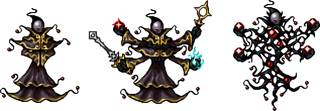
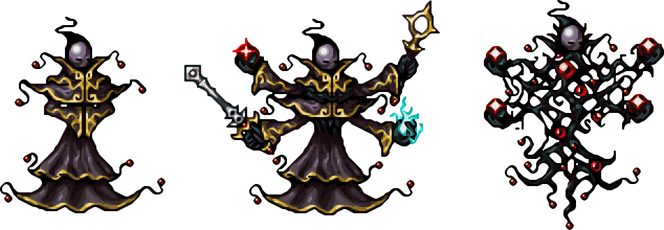

# xBRZ Examples

This file is automatically generated by the GitHub Actions workflow. It shows before and after comparisons of images upscaled using the xBRZ algorithm.

> **Note:** Images are upscaled using factors 2x, 3x, and 4x. Click on any image to view full size.

---

## threeformsPJ2.png

**Original size:** 317x110 pixels

### Original

### 2x Upscale

**Size:** 634x220 pixels

### 3x Upscale

**Size:** 951x330 pixels

### 4x Upscale

**Size:** 1268x440 pixels

---

## walk - sword.png

**Original size:** 256x256 pixels

### Original

### 2x Upscale

**Size:** 512x512 pixels

### 3x Upscale

**Size:** 768x768 pixels

### 4x Upscale

**Size:** 1024x1024 pixels

---

## About xBRZ

xBRZ is a high-quality pixel art scaling algorithm designed to upscale low-resolution images while preserving sharp edges and avoiding blurriness. It's particularly well-suited for:

- Pixel art from retro games
- Low-resolution sprites and icons
- Pixel-based graphics and animations

The algorithm analyzes pixel patterns and applies intelligent interpolation to create smooth, natural-looking upscaled images.

For more information, see: https://en.wikipedia.org/wiki/Pixel-art_scaling_algorithms#xBR_family

---

*Last updated: 2026-02-06 19:13:39 UTC*

*Generated by [GitHub Actions](https://github.com/benpm/xbrzscale/actions)*
